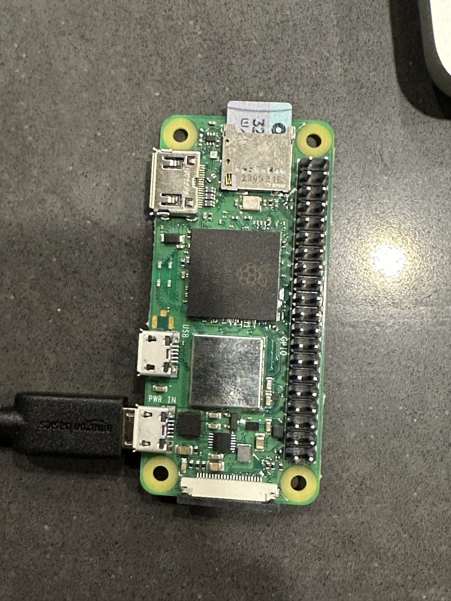
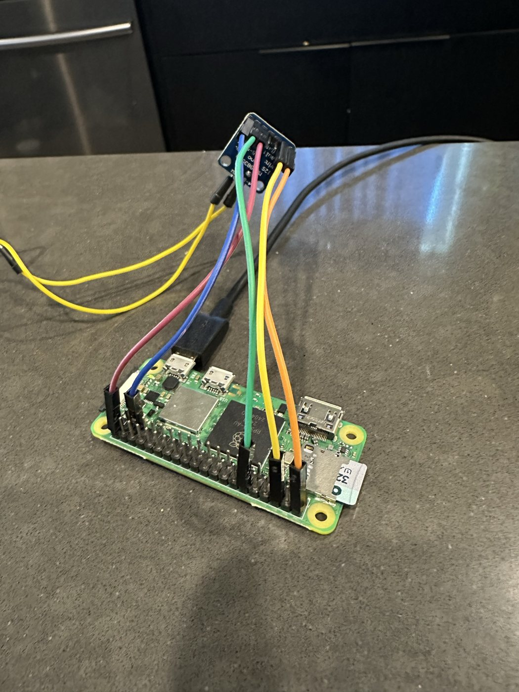
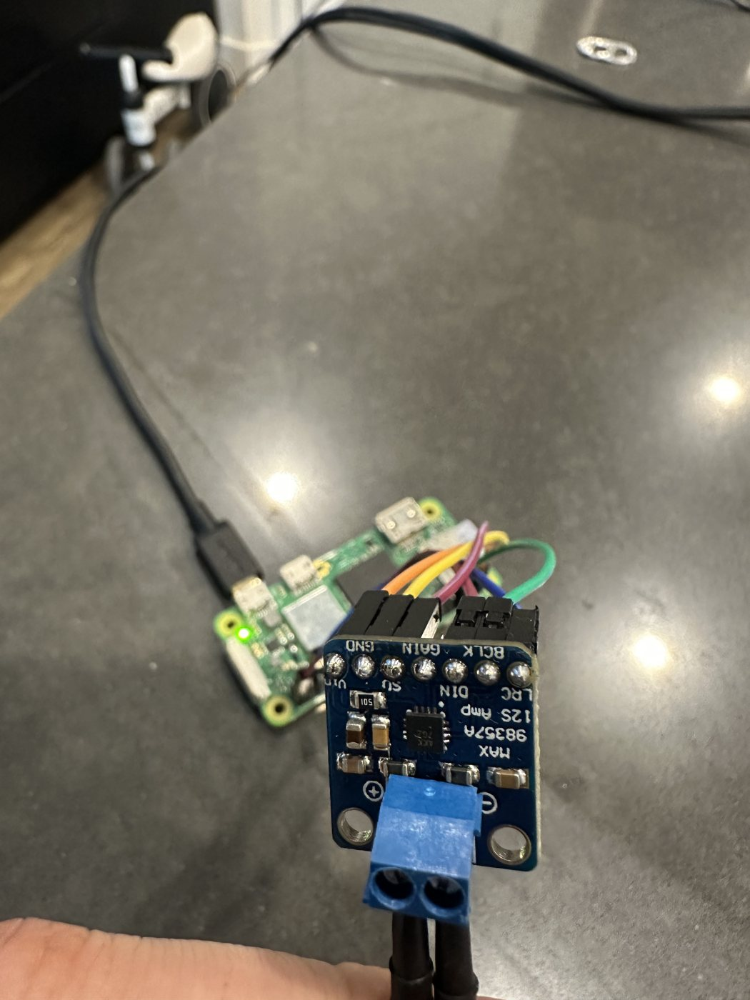

# Assembly Guide

This is the public build path for the first Magic Character Box prototype.

The goal is not a perfect toy on day one. The goal is a reliable magic moment:

```text
Place NFC character on the box -> Pi sees UID -> matching audio plays
```

If you want the shortest possible path, start with [quick-build.md](quick-build.md), then come back here for detail.

## Parts

For a fuller shopping/checkoff page, see [materials.md](materials.md).
If time is short before a birthday, use [birthday-weekend-build.md](birthday-weekend-build.md).

Required:

- Raspberry Pi Zero 2 W with soldered GPIO header.
- microSD card, 16 GB or larger.
- 5V 2A or better USB power supply.
- PN532 NFC reader, set to SPI mode.
- NTAG213/215/216 NFC stickers or fobs.
- MAX98357A I2S amp board.
- Small passive speaker, ideally 4-8 ohm.
- Jumper wires.
- Printed enclosure, cardboard box, project box, or other non-metal case.

Optional:

- M2.5 x 8 mm screws for the printed case.
- Hook-and-loop tape for the smaller sidecar enclosure.
- Thin felt or tape to cover NFC stickers in figure bases.
- USB keyboard/monitor for first Pi setup, or SSH.

## Helpful Photos

Use the wiring tables in [wiring.md](wiring.md) as the source of truth. Wire colors in photos are only examples.







## Print The Enclosure

The smaller enclosure is intended as a sidecar module: the Pi, PN532, and MAX98357A live in the printed case, then the case mounts to an existing passive speaker cabinet with hook-and-loop tape.

Ready-to-slice files:

- [`../stl/small-sidecar-enclosure-body.stl`](../stl/small-sidecar-enclosure-body.stl)
- [`../stl/small-sidecar-enclosure-lid.stl`](../stl/small-sidecar-enclosure-lid.stl)
- [`../stl/small-sidecar-enclosure-assembly.stl`](../stl/small-sidecar-enclosure-assembly.stl) for visual/reference use

Reusable figure base:

- [`../stl/nfc-character-base-flat.stl`](../stl/nfc-character-base-flat.stl)

Suggested print settings:

- PLA or PETG.
- 0.2 mm layer height.
- 3 walls.
- 4 top/bottom layers.
- 15-20% infill.
- Supports off for the body and NFC base.
- Check the lid in your slicer; support needs vary by printer.

Print orientation:

- Body: open side up.
- Lid: top side up.
- NFC character base: sticker recess down, top pad up. The shallow recess should bridge, but preview it in your slicer.

The parametric OpenSCAD source is in [`../cad/`](../cad/README.md).

## Wire The Hardware

Power the Pi off before wiring.

MAX98357A amp:

```text
MAX98357A VIN  -> Pi 5V, physical pin 2 or 4
MAX98357A GND  -> Pi GND
MAX98357A BCLK -> GPIO18, physical pin 12
MAX98357A LRC  -> GPIO19, physical pin 35
MAX98357A DIN  -> GPIO21, physical pin 40
MAX98357A SD   -> GPIO16, physical pin 36, optional but recommended
Speaker +      -> MAX98357A speaker +
Speaker -      -> MAX98357A speaker -
```

PN532 reader in SPI mode:

```text
PN532 VCC/3.3V -> Pi 3.3V, physical pin 1 or 17
PN532 GND      -> Pi GND
PN532 SCK      -> GPIO11, physical pin 23
PN532 MISO     -> GPIO9, physical pin 21
PN532 MOSI     -> GPIO10, physical pin 19
PN532 SS/CS    -> GPIO8, physical pin 24
```

Keep the PN532 under the top target area, with the antenna side facing the NFC tag. Keep metal and speaker magnets away from the reader when possible.

## Prepare The Pi

Install system packages and Python dependencies:

```bash
cd /home/pi/magic-character-box
./scripts/install_pi.sh
```

Enable SPI:

```bash
sudo raspi-config
```

Choose `Interface Options` -> `SPI` -> enable, then reboot.

For MAX98357A audio, add the overlay described in [wiring.md](wiring.md), then reboot before testing.

## Test In Small Steps

Start with mock mode:

```bash
python -m magic_box.app --nfc mock --dry-run-audio
```

Type:

```text
DINOSAUR
ROCKET
DAD
q
```

Then test real tag scanning:

```bash
python scripts/scan_tag.py --nfc pn532
```

Then test audio:

```bash
python -m magic_box.app --nfc mock
```

Only combine NFC and audio after both work separately.

## Register NFC Stickers

This project maps tag UIDs to audio folders. It does not write data to the NFC stickers.

Terminal registration:

```bash
python scripts/register_character.py --nfc pn532 --name Dinosaur --mode shuffle
```

Web registration:

```bash
python -m magic_box.admin --nfc pn532 --host 0.0.0.0 --port 8080
```

Open `http://<pi-hostname-or-ip>:8080`, scan the tag, name it, save it, then upload or record audio. The web UI creates the audio folder automatically. Audio uploads start as soon as files are selected from the file picker.

If the Scan button is disabled, the admin is probably running in mock/dev mode. Stop `magic-character-box-admin-dev`, stop the main app while registering tags, and start `magic-character-box-admin`.

More detail is in [rf-programming.md](rf-programming.md).

## Install The Services

After manual tests pass:

```bash
sudo cp systemd/magic-character-box.service /etc/systemd/system/
sudo cp systemd/magic-character-box-admin.service /etc/systemd/system/
sudo systemctl daemon-reload
```

For the MVP, use setup mode or kid playback mode, not both at once:

```bash
# Setup mode
sudo systemctl disable --now magic-character-box
sudo systemctl disable --now magic-character-box-admin-dev
sudo systemctl enable --now magic-character-box-admin

# Kid playback mode
sudo systemctl disable --now magic-character-box-admin
sudo systemctl enable --now magic-character-box
```

Watch logs:

```bash
journalctl -u magic-character-box -f
```

The admin page has no login, so keep it on a trusted home network.

If anything does not behave as expected, use [troubleshooting.md](troubleshooting.md).

## Close The Box

Before screwing the lid down:

- Confirm the speaker plays without harsh pops.
- Confirm the PN532 reads stickers through the lid.
- Confirm the Pi can still be powered and serviced by an adult.
- Strain-relieve jumper wires so a tug on the case does not pull pins loose.
- Keep loose batteries and exposed electronics away from kids.

For the sidecar enclosure, add hook-and-loop tape to the flat rear pad. Use the strap slots as a backup if adhesive tape is not enough.
