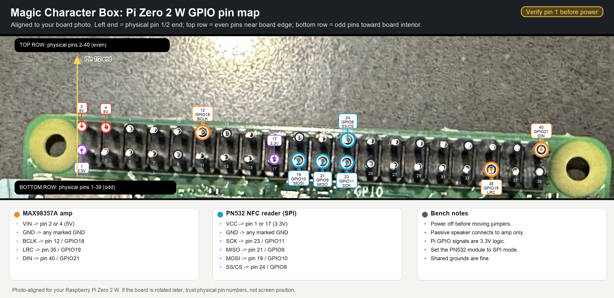

# Raspberry Pi Zero 2 W Pin Map

Use this while wiring the Magic Character Box.

Power the Pi off before moving jumper wires.



## Orientation

Raspberry Pi uses **physical pin numbers** and **BCM GPIO numbers**. They are not the same.

- Physical pins are the 1-40 header positions.
- BCM GPIO numbers are names like `GPIO18`, `GPIO10`, and `GPIO21`.
- Pin 1 is at the end of the GPIO header closest to the microSD card on the Pi Zero family.
- If you are unsure, find the square/silkscreen-marked pin 1 pad, or run `pinout` on Raspberry Pi OS.

## Project Wiring Summary

These pins are reserved for the first public build:

- `MAX98357A` I2S amp for audio.
- AITRIP PN532 V3-style NFC reader in SPI mode.

The same reservation is also stored as machine-readable JSON in [`config/pin-reservations.json`](../config/pin-reservations.json).

### MAX98357A I2S Amp

| Amp pin | Pi physical pin | Pi signal |
| --- | ---: | --- |
| `VIN` | 2 or 4 | 5V |
| `GND` | 14, 20, 30, 34, or 39 | GND |
| `BCLK` | 12 | `GPIO18` / PCM clock |
| `LRC` | 35 | `GPIO19` / PCM frame sync |
| `DIN` | 40 | `GPIO21` / PCM data out |
| `SD` | 36 | `GPIO16` / optional anti-pop mute gate |

Speaker wires go only to the amp screw terminals. Do not connect a passive speaker directly to Pi GPIO.

### PN532 NFC Reader, SPI Mode

This is the reservation for the AITRIP PN532 module linked in the project notes. Use the reader in SPI mode. The board may label chip select as `SS` or `CS`.

| PN532 pin | Pi physical pin | Pi signal |
| --- | ---: | --- |
| `3.3V` / `VCC` | 1 or 17 | 3.3V |
| `GND` | 6, 9, or 25 | GND |
| `SCK` | 23 | `GPIO11` / SPI0 SCLK |
| `MISO` | 21 | `GPIO9` / SPI0 MISO |
| `MOSI` | 19 | `GPIO10` / SPI0 MOSI |
| `SS` / `CS` | 24 | `GPIO8` / SPI0 CE0 |

Set the PN532 board switches/jumpers to SPI mode.

## Reserved Pin Ledger

Do not use these GPIO pins for buttons, LEDs, sensors, displays, or future features unless the audio/NFC design changes.

| Reserved for | BCM GPIO | Physical pin | Purpose |
| --- | ---: | ---: | --- |
| MAX98357A | `GPIO18` | 12 | I2S `BCLK` |
| MAX98357A | `GPIO19` | 35 | I2S `LRC` |
| MAX98357A | `GPIO21` | 40 | I2S `DIN` |
| MAX98357A | `GPIO16` | 36 | Optional `SD` shutdown/mute gate |
| AITRIP PN532 | `GPIO11` | 23 | SPI0 `SCLK` |
| AITRIP PN532 | `GPIO9` | 21 | SPI0 `MISO` |
| AITRIP PN532 | `GPIO10` | 19 | SPI0 `MOSI` |
| AITRIP PN532 | `GPIO8` | 24 | SPI0 `CE0` / `SS` / `CS` |

Power pins also reserved by convention:

| Reserved for | Physical pin | Purpose |
| --- | ---: | --- |
| MAX98357A | 2 or 4 | 5V power |
| AITRIP PN532 | 1 or 17 | 3.3V power |
| Both boards | 6, 9, 14, 20, 25, 30, 34, or 39 | Shared ground |

## Recommended Future Pins

If you add buttons or a status LED later, start here:

| Future feature | BCM GPIO | Physical pin | Notes |
| --- | ---: | ---: | --- |
| Play/pause button | `GPIO17` | 11 | Good general-purpose input |
| Volume down button | `GPIO27` | 13 | Good general-purpose input |
| Volume up button | `GPIO22` | 15 | Good general-purpose input |
| Next track button | `GPIO23` | 16 | Good general-purpose input |
| Status LED | `GPIO24` | 18 | Use a resistor |

Avoid for now:

- `GPIO2` / pin 3 and `GPIO3` / pin 5: keep I2C free for future displays/sensors.
- `GPIO14` / pin 8 and `GPIO15` / pin 10: keep UART free for serial console/debugging.
- `GPIO0` / pin 27 and `GPIO1` / pin 28: ID EEPROM pins.
- `GPIO20` / pin 38: another PCM/I2S data pin; leave unused while audio is on I2S.

## Full 40-Pin Header

Start at the pin 1 end, closest to the microSD card, then count down in pairs.

```text
Pin 1 end / microSD end

 Physical  Signal                  Physical  Signal
 --------  ---------------------   --------  ---------------------
 1         3.3V                     2         5V
 3         GPIO2 / I2C SDA          4         5V
 5         GPIO3 / I2C SCL          6         GND
 7         GPIO4                    8         GPIO14 / UART TX
 9         GND                      10        GPIO15 / UART RX
 11        GPIO17                   12        GPIO18 / I2S BCLK
 13        GPIO27                   14        GND
 15        GPIO22                   16        GPIO23
 17        3.3V                     18        GPIO24
 19        GPIO10 / SPI0 MOSI       20        GND
 21        GPIO9 / SPI0 MISO        22        GPIO25
 23        GPIO11 / SPI0 SCLK       24        GPIO8 / SPI0 CE0
 25        GND                      26        GPIO7 / SPI0 CE1
 27        GPIO0 / ID_SD            28        GPIO1 / ID_SC
 29        GPIO5                    30        GND
 31        GPIO6                    32        GPIO12 / PWM0
 33        GPIO13 / PWM1            34        GND
 35        GPIO19 / I2S LRC         36        GPIO16
 37        GPIO26                   38        GPIO20 / PCM DIN
 39        GND                      40        GPIO21 / I2S DIN
```

## Pins This Project Uses

```text
Power:
  5V      -> MAX98357A VIN
  3.3V    -> PN532 VCC
  GND     -> both boards

I2S audio:
  GPIO18 / pin 12 -> MAX98357A BCLK
  GPIO19 / pin 35 -> MAX98357A LRC
  GPIO21 / pin 40 -> MAX98357A DIN
  GPIO16 / pin 36 -> MAX98357A SD optional anti-pop mute gate

SPI NFC:
  GPIO11 / pin 23 -> PN532 SCK
  GPIO9  / pin 21 -> PN532 MISO
  GPIO10 / pin 19 -> PN532 MOSI
  GPIO8  / pin 24 -> PN532 SS/CS
```

## Safety Notes

- Pi GPIO logic is 3.3V. Do not feed 5V into a GPIO signal pin.
- Use the Pi 5V pins only for boards that expect 5V power, such as the MAX98357A `VIN`.
- Use the Pi 3.3V pins for the PN532 logic/power unless your specific board documentation says otherwise.
- Never connect a motor, relay, passive speaker, or other load directly to GPIO.
- If a jumper wire feels uncertain, stop and verify the physical pin number before powering on.

## References

- Raspberry Pi GPIO and 40-pin header docs: https://www.raspberrypi.com/documentation/computers/raspberry-pi.html#gpio-and-the-40-pin-header
- Raspberry Pi docs note that Raspberry Pi OS includes the `pinout` command via GPIO Zero.
- Raspberry Pi docs list SPI0 as `GPIO10` MOSI, `GPIO9` MISO, `GPIO11` SCLK, `GPIO8` CE0.
